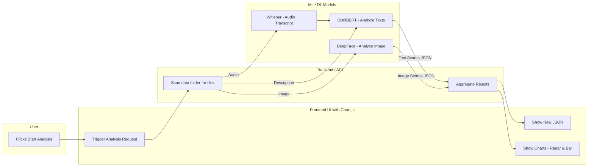
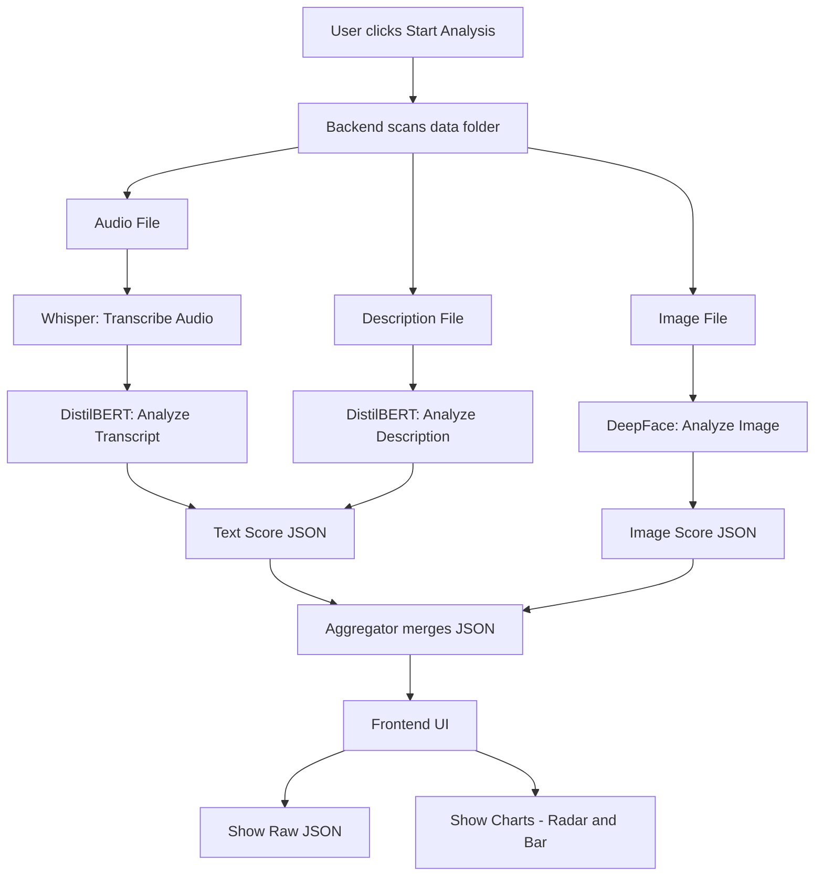

# DREAM Integration: Multimodal Emotion & Sentiment Analysis

This project lays the complete groundwork — a strong and functional base variant — for multimodal sentiment and emotion analysis. It processes image, audio, and text data while treating time and ordering as key components. Time plays an important role in connecting and understanding the flow of these inputs. Rather than viewing each input in isolation, the system captures the sequence of events, helping us understand how earlier moments shape emotional responses in later ones. Data mining is used to detect patterns and trends by organizing multimodal emotion data in a timeline per person, allowing us to trace how feelings evolve over time. This approach builds a richer narrative from lived experiences, aligning with Beehive’s goal of creating time-aware, emotion-driven digital memory systems.

## Current Status

- Project structure, sample data folders, virtual environment, and requirements file created.
- Audio transcript generation using [OpenAI Whisper](https://github.com/openai/whisper).
- Text emotion scoring using DistilBERT; results stored in structured format (`analysis-*/text_scores.json`).
- Image sentiment analysis integrated using DeepFace.
- Unified **analysis pipeline** in Flask:
  - Transcription → Text analysis → Image analysis.
  - Handles missing transcripts, avoids overwriting, ensures consistent output storage.
- **Radar chart visualization** added for comparing text vs image emotions.
- Progress bars and collapsible raw JSON views included in UI.

## Tools Used

- Whisper (for audio transcription)
- HuggingFace Transformers + DistilBERT (for text emotion scoring)
- Torch (PyTorch backend)
- DeepFace (for facial emotion/sentiment analysis)
- Flask + Chart.js (for web UI & visualization)
- Python 3.x, Virtualenv

## Project Folder Highlights

- `dream-integration/analysis/` → Modular scripts for analyzing text, audio, and image inputs.
- `dream-integration/data/person-01/analysis-*/` → Per-user, per-sample emotion scores stored in JSON format.

## Future Scope

- Extending the current end-to-end tested implementation (single-person multi-sample) to handle **multi-person multi-sample** analysis.
- Visualization can be further enriched into **timeline-based analysis**, to track emotional progression over time. This will be more meaningful when a larger dataset becomes available in the future.

## Architecture

The workflow is designed around three modalities: **Audio, Text, and Image**.
All input data is scanned from the data/ directory and processed step by step through specialized models. Results are aggregated and displayed via a simple web UI with Chart.js visualizations.

### High-Level Architecture Diagram

### Workflow (Step-by-Step)

Below is a step-by-step pipeline of how the system works when the user starts analysis:

## Setup & Contributing

For setup instructions and contributing guidelines, please go through the dedicated file.  
(Currently working on it, will be added soon.)

## License

This project is licensed under the MIT License. See the [LICENSE](/LICENSE) file for more details.
